# Лабораторна робота №2. Нечітке моделювання функції з двох змінних

**Мета роботи:** Побудувати нечітку модель заданої функції двох змінних та оцінити точність моделювання; дослідити вплив форми функцій приналежності та (за потреби) структури правил.

## Що зроблено
- Задано базові дані: сформовано масиви x та обчислено y, z за формулами із завдання.
- Побудовано терм-множини: по 6 ФП для вхідних змінних та 9 ФП для вихідної змінної.
- Побудовано та порівняно різні форми ФП (трикутні/трапецієподібні/гауссові) з візуалізацією.
- Сформовано правила та виконано нечіткий висновок для отримання ẑ, після чого пораховано метрики похибки (зокрема MSE/MAE та середню відносну похибку).

## Для чого це зроблено
- Нечітка модель (Mamdani/Sugeno-подібна) дозволяє апроксимувати складні залежності через інтерпретовані правила.
- Порівняння форм ФП показує, як вибір параметризації впливає на якість апроксимації.

## Результат
- Отримано прогнозні значення ẑ та чисельні оцінки похибок для різних форм ФП.


---


Імпортуємо модулі, задаємо x від 0 до 20, рахуємо y та z за умовою.

$y = x \cdot \sin(x) \cdot \cos(x)$

$z = \cos(\sin(y)) \cdot \sin(x)$


```python
import numpy as np
import matplotlib.pyplot as plt
import skfuzzy as fuzz
from tabulate import tabulate
from sklearn.metrics import mean_squared_error, mean_absolute_error

QUALITY = 1000

x_values = np.linspace(0, 20, QUALITY)
y_values = x_values * np.sin(x_values) * np.cos(x_values)
z_values = np.cos(np.sin(y_values)) * np.sin(x_values)

plt.plot(x_values, y_values)
plt.title("$y = x \\cdot \\sin(x) \\cdot \\cos(x)$")
plt.show()

plt.plot(x_values, z_values)
plt.title("$z = \\cos(\\sin(y)) \\cdot \\sin(x)$")
plt.show()
```


    
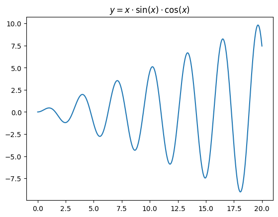
    


    
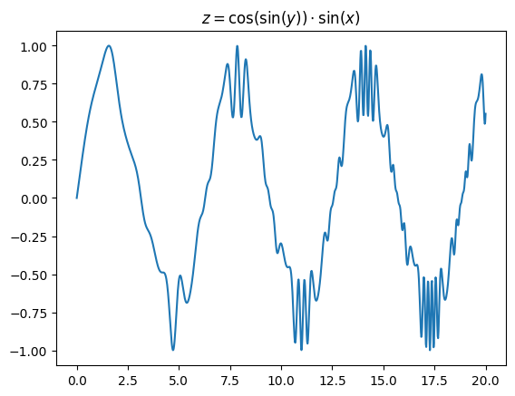
    


Створюємо проміжки для функції приналежності. По 6 для вхідних даних, 9 для вихідних.


```python
x_means = np.linspace(float(np.min(x_values)), float(np.max(x_values)), 6)
y_means = np.linspace(float(np.min(y_values)), float(np.max(y_values)), 6)
z_means = np.linspace(float(np.min(z_values)), float(np.max(z_values)), 9)

step_x = (float(np.max(x_values)) - float(np.min(x_values))) / (6 - 1)
step_y = (float(np.max(y_values)) - float(np.min(y_values))) / (6 - 1)
step_z = (float(np.max(z_values)) - float(np.min(z_values))) / (9 - 1)
```

Трикутні функції приналежності та їх графіки.


```python
for i in range(6):
    plt.plot(
        x_values,
        fuzz.trimf(x_values, [x_means[i] - step_x, x_means[i], x_means[i] + step_x]),
    )
plt.title("X: trimf")
plt.show()

yy = np.linspace(float(np.min(y_values)), float(np.max(y_values)), QUALITY)
for i in range(6):
    plt.plot(yy, fuzz.trimf(yy, [y_means[i] - step_y, y_means[i], y_means[i] + step_y]))
plt.title("Y: trimf")
plt.show()

zz = np.linspace(float(np.min(z_values)), float(np.max(z_values)), QUALITY)
for i in range(9):
    plt.plot(zz, fuzz.trimf(zz, [z_means[i] - step_z, z_means[i], z_means[i] + step_z]))
plt.title("Z: trimf")
plt.show()
```


    
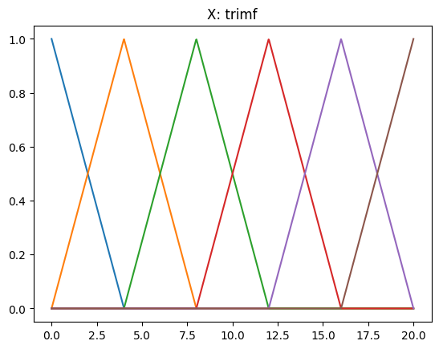
    


    
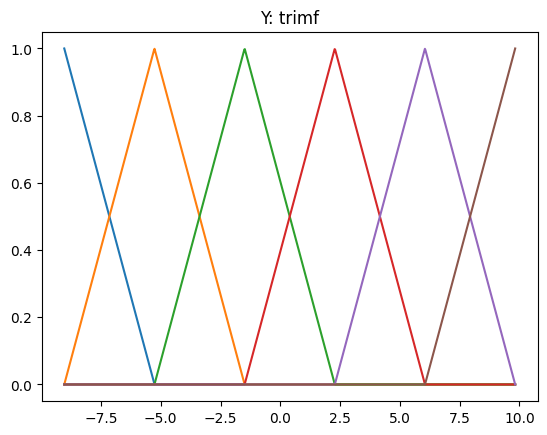
    


    
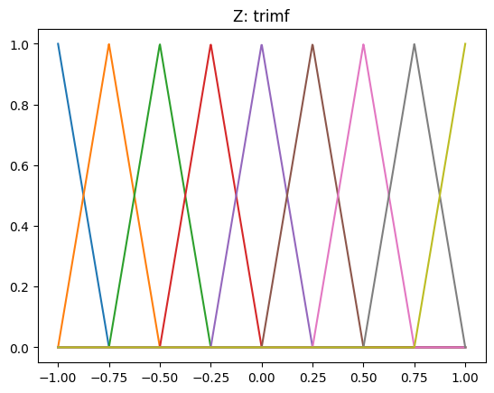
    


Трапецієподібні функції приналежності та їх графіки.


```python
for i in range(6):
    plt.plot(
        x_values,
        fuzz.trapmf(
            x_values,
            [
                x_means[i] - step_x,
                x_means[i] - step_x / 2,
                x_means[i] + step_x / 2,
                x_means[i] + step_x,
            ],
        ),
    )
plt.title("X: trapmf")
plt.show()

for i in range(6):
    plt.plot(
        yy,
        fuzz.trapmf(
            yy,
            [
                y_means[i] - step_y,
                y_means[i] - step_y / 2,
                y_means[i] + step_y / 2,
                y_means[i] + step_y,
            ],
        ),
    )
plt.title("Y: trapmf")
plt.show()

for i in range(9):
    plt.plot(
        zz,
        fuzz.trapmf(
            zz,
            [
                z_means[i] - step_z,
                z_means[i] - step_z / 2,
                z_means[i] + step_z / 2,
                z_means[i] + step_z,
            ],
        ),
    )
plt.title("Z: trapmf")
plt.show()
```


    
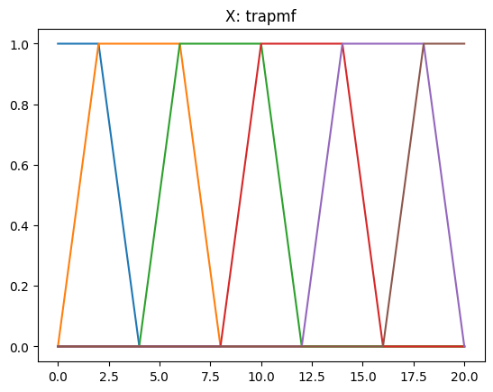
    


    
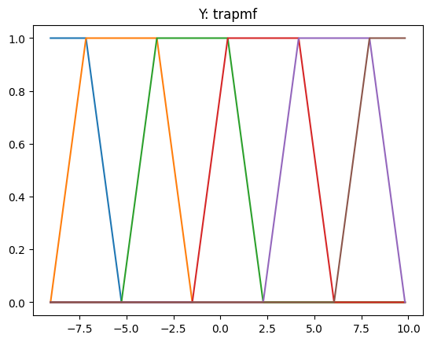
    


    
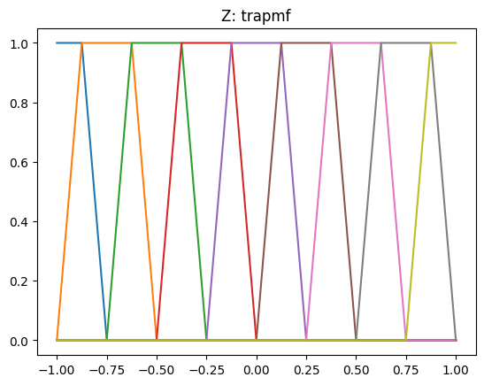
    


Гаусівські функції приналежності та їх графіки.


```python
for i in range(6):
    plt.plot(x_values, fuzz.gaussmf(x_values, x_means[i], step_x / 2))
plt.title("X: gaussmf")
plt.show()

for i in range(6):
    plt.plot(yy, fuzz.gaussmf(yy, y_means[i], step_y / 2))
plt.title("Y: gaussmf")
plt.show()

for i in range(9):
    plt.plot(zz, fuzz.gaussmf(zz, z_means[i], step_z / 2))
plt.title("Z: gaussmf")
plt.show()
```


    
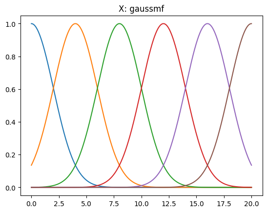
    


    
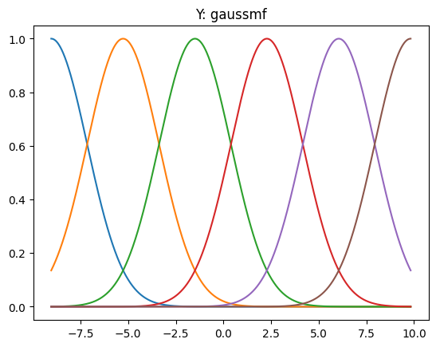
    


    
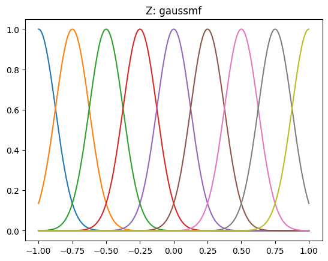
    


Допоміжні функції для обчислення ступеня приналежності і вибору найкращої функції приналежності


```python
def calculate_trimf(x, m, diff):
    a, b, c = m - diff, m, m + diff
    if a <= x < b:
        return (x - a) / (b - a)
    elif b <= x <= c:
        return (c - x) / (c - b)
    else:
        return 0


def functionCompareTri(value, means, diff):
    best_func_value = -1.0
    best_index = -1
    for index, mean in enumerate(means):
        ff = calculate_trimf(value, mean, diff)
        if ff > best_func_value:
            best_func_value = ff
            best_index = index
    return best_index
```

Трикутні функції приналежності: формуємо таблицю правил за максимумом вихідних функцій приналежності, будуємо модель і рахуємо похибки.


```python
print("Таблиця значень")
table = [["y\\x"] + [str(x) for x in x_means]]
for y_value in y_means:
    row = [round(y_value, 2)]
    for x in x_means:
        z = np.cos(np.sin(y_value)) * np.sin(x)
        row.append(round(z, 2))
    table.append(row)
print(tabulate(table, tablefmt="grid"))


rules = {}
table = [["y\\x"] + ["mx" + str(i) for i in range(1, 7)]]
for i in range(6):
    row = [f"my{i + 1}"]
    for j in range(6):
        z = np.cos(np.sin(y_means[i])) * np.sin(x_means[j])
        best_func = functionCompareTri(z, z_means, step_z)
        row.append("mf" + str(best_func + 1))
        rules[(j, i)] = best_func
    table.append(row)
print("Таблица з назвами функцій")
print(tabulate(table, tablefmt="grid"))

print("\nRules:")
for rule in rules.keys():
    print(
        f"if (x is mx{rule[0] + 1}) and (y is my{rule[1] + 1}) then (z is mf{rules[rule] + 1})"
    )

z_output = []
for x in x_values:
    best_x_func = functionCompareTri(x, x_means, step_x)
    best_y_func = functionCompareTri(x * np.sin(x) * np.cos(x), y_means, step_y)
    best_z_func = rules[(best_x_func, best_y_func)]
    z_output.append(z_means[best_z_func])
z_output = np.array(z_output)

plt.plot(x_values, z_output, label="Model")
plt.plot(x_values, z_values, label="True")
plt.title("Справжня і змодельована функції")
plt.legend()
plt.show()

mse = mean_squared_error(z_values, z_output)
mae = mean_absolute_error(z_values, z_output)
print(f"Mean Squared Error (MSE) = {mse}")
print(f"Mean Absolute Error (MAE) = {mae}")

```

    Таблиця значень
    +-------+---+-------+------+-------+-------+-------+
    | y\x   | 0 |  4    | 8    | 12    | 16    | 20    |
    +-------+---+-------+------+-------+-------+-------+
    | -9.04 | 0 | -0.7  | 0.92 | -0.5  | -0.27 |  0.85 |
    +-------+---+-------+------+-------+-------+-------+
    | -5.26 | 0 | -0.5  | 0.65 | -0.35 | -0.19 |  0.6  |
    +-------+---+-------+------+-------+-------+-------+
    | -1.49 | 0 | -0.41 | 0.54 | -0.29 | -0.16 |  0.5  |
    +-------+---+-------+------+-------+-------+-------+
    | 2.28  | 0 | -0.55 | 0.72 | -0.39 | -0.21 |  0.66 |
    +-------+---+-------+------+-------+-------+-------+
    | 6.05  | 0 | -0.74 | 0.96 | -0.52 | -0.28 |  0.89 |
    +-------+---+-------+------+-------+-------+-------+
    | 9.82  | 0 | -0.7  | 0.92 | -0.5  | -0.27 |  0.85 |
    +-------+---+-------+------+-------+-------+-------+
    Таблица з назвами функцій
    +-----+-----+-----+-----+-----+-----+-----+
    | y\x | mx1 | mx2 | mx3 | mx4 | mx5 | mx6 |
    +-----+-----+-----+-----+-----+-----+-----+
    | my1 | mf5 | mf2 | mf9 | mf3 | mf4 | mf8 |
    +-----+-----+-----+-----+-----+-----+-----+
    | my2 | mf5 | mf3 | mf8 | mf4 | mf4 | mf7 |
    +-----+-----+-----+-----+-----+-----+-----+
    | my3 | mf5 | mf3 | mf7 | mf4 | mf4 | mf7 |
    +-----+-----+-----+-----+-----+-----+-----+
    | my4 | mf5 | mf3 | mf8 | mf3 | mf4 | mf8 |
    +-----+-----+-----+-----+-----+-----+-----+
    | my5 | mf5 | mf2 | mf9 | mf3 | mf4 | mf9 |
    +-----+-----+-----+-----+-----+-----+-----+
    | my6 | mf5 | mf2 | mf9 | mf3 | mf4 | mf8 |
    +-----+-----+-----+-----+-----+-----+-----+
    
    Rules:
    if (x is mx1) and (y is my1) then (z is mf5)
    if (x is mx2) and (y is my1) then (z is mf2)
    if (x is mx3) and (y is my1) then (z is mf9)
    if (x is mx4) and (y is my1) then (z is mf3)
    if (x is mx5) and (y is my1) then (z is mf4)
    if (x is mx6) and (y is my1) then (z is mf8)
    if (x is mx1) and (y is my2) then (z is mf5)
    if (x is mx2) and (y is my2) then (z is mf3)
    if (x is mx3) and (y is my2) then (z is mf8)
    if (x is mx4) and (y is my2) then (z is mf4)
    if (x is mx5) and (y is my2) then (z is mf4)
    if (x is mx6) and (y is my2) then (z is mf7)
    if (x is mx1) and (y is my3) then (z is mf5)
    if (x is mx2) and (y is my3) then (z is mf3)
    if (x is mx3) and (y is my3) then (z is mf7)
    if (x is mx4) and (y is my3) then (z is mf4)
    if (x is mx5) and (y is my3) then (z is mf4)
    if (x is mx6) and (y is my3) then (z is mf7)
    if (x is mx1) and (y is my4) then (z is mf5)
    if (x is mx2) and (y is my4) then (z is mf3)
    if (x is mx3) and (y is my4) then (z is mf8)
    if (x is mx4) and (y is my4) then (z is mf3)
    if (x is mx5) and (y is my4) then (z is mf4)
    if (x is mx6) and (y is my4) then (z is mf8)
    if (x is mx1) and (y is my5) then (z is mf5)
    if (x is mx2) and (y is my5) then (z is mf2)
    if (x is mx3) and (y is my5) then (z is mf9)
    if (x is mx4) and (y is my5) then (z is mf3)
    if (x is mx5) and (y is my5) then (z is mf4)
    if (x is mx6) and (y is my5) then (z is mf9)
    if (x is mx1) and (y is my6) then (z is mf5)
    if (x is mx2) and (y is my6) then (z is mf2)
    if (x is mx3) and (y is my6) then (z is mf9)
    if (x is mx4) and (y is my6) then (z is mf3)
    if (x is mx5) and (y is my6) then (z is mf4)
    if (x is mx6) and (y is my6) then (z is mf8)
    


    
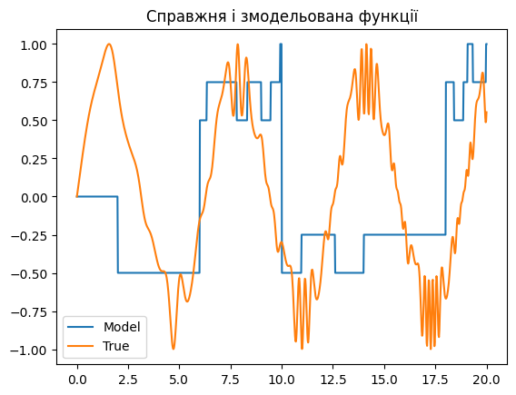
    


    Mean Squared Error (MSE) = 0.3677986820695678
    Mean Absolute Error (MAE) = 0.4859365171322268
    

Трапецієподібні функції приналежності: формуємо таблицю правил за максимумом вихідних функцій приналежності, будуємо модель і рахуємо похибки.


```python
def calculate_trapmf(x, m, half, top):
    a, b, c, d = m - half, m - top, m + top, m + half
    if a <= x < b:
        return (x - a) / (b - a)
    elif b <= x <= c:
        return 1
    elif c < x <= d:
        return (d - x) / (d - c)
    else:
        return 0


def functionCompareTrap(value, means, diff, top):
    best_func_value = -1.0
    best_index = -1
    for index, mean in enumerate(means):
        ff = calculate_trapmf(value, mean, diff, top)
        if ff > best_func_value:
            best_func_value = ff
            best_index = index
    return best_index
```


```python
rules = {}
table = [["y\\x"] + ["mx" + str(i) for i in range(1, 7)]]
for i in range(6):
    row = [f"my{i + 1}"]
    for j in range(6):
        z = np.cos(np.sin(y_means[i])) * np.sin(x_means[j])
        best_func = functionCompareTrap(z, z_means, step_z, step_z / 2)
        row.append(f"mf{best_func+1}")
        rules[(j, i)] = best_func
    table.append(row)
print("Таблица з назвами функцій")
print(tabulate(table, tablefmt="grid"))

print("\nRules:")
for rule in rules.keys():
    print(
        f"if (x is mx{rule[0] + 1}) and (y is my{rule[1] + 1}) then (z is mf{rules[rule] + 1})"
    )

z_output = []
for x in x_values:
    best_x_func = functionCompareTrap(x, x_means, step_x, step_x / 2)
    best_y_func = functionCompareTrap(
        x * np.sin(x) * np.cos(x), y_means, step_y, step_y / 2
    )
    best_z_func = rules[(best_x_func, best_y_func)]
    z_output.append(z_means[best_z_func])
z_output = np.array(z_output)

plt.plot(x_values, z_output, label="Model")
plt.plot(x_values, z_values, label="True")
plt.title("Справжня і змодельована функції")
plt.legend()
plt.show()

mse = mean_squared_error(z_values, z_output)
mae = mean_absolute_error(z_values, z_output)
print(f"\nMean Squared Error (MSE) = {mse}")
print(f"Mean Absolute Error (MAE) = {mae}")
```

    Таблица з назвами функцій
    +-----+-----+-----+-----+-----+-----+-----+
    | y\x | mx1 | mx2 | mx3 | mx4 | mx5 | mx6 |
    +-----+-----+-----+-----+-----+-----+-----+
    | my1 | mf5 | mf2 | mf9 | mf3 | mf4 | mf8 |
    +-----+-----+-----+-----+-----+-----+-----+
    | my2 | mf5 | mf3 | mf8 | mf4 | mf4 | mf7 |
    +-----+-----+-----+-----+-----+-----+-----+
    | my3 | mf5 | mf3 | mf7 | mf4 | mf4 | mf7 |
    +-----+-----+-----+-----+-----+-----+-----+
    | my4 | mf5 | mf3 | mf8 | mf3 | mf4 | mf8 |
    +-----+-----+-----+-----+-----+-----+-----+
    | my5 | mf5 | mf2 | mf9 | mf3 | mf4 | mf9 |
    +-----+-----+-----+-----+-----+-----+-----+
    | my6 | mf5 | mf2 | mf9 | mf3 | mf4 | mf8 |
    +-----+-----+-----+-----+-----+-----+-----+
    
    Rules:
    if (x is mx1) and (y is my1) then (z is mf5)
    if (x is mx2) and (y is my1) then (z is mf2)
    if (x is mx3) and (y is my1) then (z is mf9)
    if (x is mx4) and (y is my1) then (z is mf3)
    if (x is mx5) and (y is my1) then (z is mf4)
    if (x is mx6) and (y is my1) then (z is mf8)
    if (x is mx1) and (y is my2) then (z is mf5)
    if (x is mx2) and (y is my2) then (z is mf3)
    if (x is mx3) and (y is my2) then (z is mf8)
    if (x is mx4) and (y is my2) then (z is mf4)
    if (x is mx5) and (y is my2) then (z is mf4)
    if (x is mx6) and (y is my2) then (z is mf7)
    if (x is mx1) and (y is my3) then (z is mf5)
    if (x is mx2) and (y is my3) then (z is mf3)
    if (x is mx3) and (y is my3) then (z is mf7)
    if (x is mx4) and (y is my3) then (z is mf4)
    if (x is mx5) and (y is my3) then (z is mf4)
    if (x is mx6) and (y is my3) then (z is mf7)
    if (x is mx1) and (y is my4) then (z is mf5)
    if (x is mx2) and (y is my4) then (z is mf3)
    if (x is mx3) and (y is my4) then (z is mf8)
    if (x is mx4) and (y is my4) then (z is mf3)
    if (x is mx5) and (y is my4) then (z is mf4)
    if (x is mx6) and (y is my4) then (z is mf8)
    if (x is mx1) and (y is my5) then (z is mf5)
    if (x is mx2) and (y is my5) then (z is mf2)
    if (x is mx3) and (y is my5) then (z is mf9)
    if (x is mx4) and (y is my5) then (z is mf3)
    if (x is mx5) and (y is my5) then (z is mf4)
    if (x is mx6) and (y is my5) then (z is mf9)
    if (x is mx1) and (y is my6) then (z is mf5)
    if (x is mx2) and (y is my6) then (z is mf2)
    if (x is mx3) and (y is my6) then (z is mf9)
    if (x is mx4) and (y is my6) then (z is mf3)
    if (x is mx5) and (y is my6) then (z is mf4)
    if (x is mx6) and (y is my6) then (z is mf8)
    


    

    


    
    Mean Squared Error (MSE) = 0.3677986820695678
    Mean Absolute Error (MAE) = 0.4859365171322268
    

Гауссівські функції приналежності: формуємо таблицю правил за максимумом вихідних функцій приналежності, будуємо модель і рахуємо похибки.


```python
def calculate_gaussmf(x, m, s):
    if s == 0:
        return 1.0 if x == m else 0.0
    return float(np.exp(-((x - m) ** 2) / (2 * s**2)))


def functionCompareGauss(value, means, sigma):
    best_func_value = -1.0
    best_index = -1
    for index, mean in enumerate(means):
        ff = calculate_gaussmf(value, mean, sigma)
        if ff > best_func_value:
            best_func_value = ff
            best_index = index
    return best_index
```


```python
rules = {}
table = [["y\\x"] + ["mx" + str(i) for i in range(1, 7)]]
for i in range(6):
    row = [f"my{i + 1}"]
    for j in range(6):
        z = np.cos(np.sin(y_means[i])) * np.sin(x_means[j])
        best_func = functionCompareGauss(z, z_means, step_z / 2)
        rules[(j, i)] = best_func
        row.append(f"mf{best_func+1}")
    table.append(row)
print("Таблица з назвами функцій")
print(tabulate(table, tablefmt="grid"))

print("\nRules:")
for rule in rules.keys():
    print(
        f"if (x is mx{rule[0] + 1}) and (y is my{rule[1] + 1}) then (z is mf{rules[rule] + 1})"
    )

z_output = []
for x in x_values:
    best_x_func = functionCompareGauss(x, x_means, step_x / 2)
    best_y_func = functionCompareGauss(x * np.sin(x) * np.cos(x), y_means, step_y / 2)
    best_z_func = rules[(best_x_func, best_y_func)]
    z_output.append(z_means[best_z_func])
z_output = np.array(z_output)

plt.plot(x_values, z_output, label="Model")
plt.plot(x_values, z_values, label="True")
plt.title("Справжня і змодельована функції")
plt.legend()
plt.show()

mse = mean_squared_error(z_values, z_output)
mae = mean_absolute_error(z_values, z_output)
print(f"\nMean Squared Error (MSE) = {mse}")
print(f"Mean Absolute Error (MAE) = {mae}")
```

    Таблица з назвами функцій
    +-----+-----+-----+-----+-----+-----+-----+
    | y\x | mx1 | mx2 | mx3 | mx4 | mx5 | mx6 |
    +-----+-----+-----+-----+-----+-----+-----+
    | my1 | mf5 | mf2 | mf9 | mf3 | mf4 | mf8 |
    +-----+-----+-----+-----+-----+-----+-----+
    | my2 | mf5 | mf3 | mf8 | mf4 | mf4 | mf7 |
    +-----+-----+-----+-----+-----+-----+-----+
    | my3 | mf5 | mf3 | mf7 | mf4 | mf4 | mf7 |
    +-----+-----+-----+-----+-----+-----+-----+
    | my4 | mf5 | mf3 | mf8 | mf3 | mf4 | mf8 |
    +-----+-----+-----+-----+-----+-----+-----+
    | my5 | mf5 | mf2 | mf9 | mf3 | mf4 | mf9 |
    +-----+-----+-----+-----+-----+-----+-----+
    | my6 | mf5 | mf2 | mf9 | mf3 | mf4 | mf8 |
    +-----+-----+-----+-----+-----+-----+-----+
    
    Rules:
    if (x is mx1) and (y is my1) then (z is mf5)
    if (x is mx2) and (y is my1) then (z is mf2)
    if (x is mx3) and (y is my1) then (z is mf9)
    if (x is mx4) and (y is my1) then (z is mf3)
    if (x is mx5) and (y is my1) then (z is mf4)
    if (x is mx6) and (y is my1) then (z is mf8)
    if (x is mx1) and (y is my2) then (z is mf5)
    if (x is mx2) and (y is my2) then (z is mf3)
    if (x is mx3) and (y is my2) then (z is mf8)
    if (x is mx4) and (y is my2) then (z is mf4)
    if (x is mx5) and (y is my2) then (z is mf4)
    if (x is mx6) and (y is my2) then (z is mf7)
    if (x is mx1) and (y is my3) then (z is mf5)
    if (x is mx2) and (y is my3) then (z is mf3)
    if (x is mx3) and (y is my3) then (z is mf7)
    if (x is mx4) and (y is my3) then (z is mf4)
    if (x is mx5) and (y is my3) then (z is mf4)
    if (x is mx6) and (y is my3) then (z is mf7)
    if (x is mx1) and (y is my4) then (z is mf5)
    if (x is mx2) and (y is my4) then (z is mf3)
    if (x is mx3) and (y is my4) then (z is mf8)
    if (x is mx4) and (y is my4) then (z is mf3)
    if (x is mx5) and (y is my4) then (z is mf4)
    if (x is mx6) and (y is my4) then (z is mf8)
    if (x is mx1) and (y is my5) then (z is mf5)
    if (x is mx2) and (y is my5) then (z is mf2)
    if (x is mx3) and (y is my5) then (z is mf9)
    if (x is mx4) and (y is my5) then (z is mf3)
    if (x is mx5) and (y is my5) then (z is mf4)
    if (x is mx6) and (y is my5) then (z is mf9)
    if (x is mx1) and (y is my6) then (z is mf5)
    if (x is mx2) and (y is my6) then (z is mf2)
    if (x is mx3) and (y is my6) then (z is mf9)
    if (x is mx4) and (y is my6) then (z is mf3)
    if (x is mx5) and (y is my6) then (z is mf4)
    if (x is mx6) and (y is my6) then (z is mf8)
    


    

    


    
    Mean Squared Error (MSE) = 0.3677986820695678
    Mean Absolute Error (MAE) = 0.4859365171322268
    

Висновок: Для моделювання функції приналежності були використані три типи функцій — трикутні, трапецієподібні та гаусівські. Всі моделі показали схожу якість апроксимації, що підтверджується низькими значеннями похибок. Гаусівські функції приналежності зазвичай забезпечують найкращу гладкість моделі, але в цьому випадку відмінність відсутня.


---


## Висновки
- Побудовано нечітку модель функції та експериментально показано вплив вибору ФП на точність моделювання.

