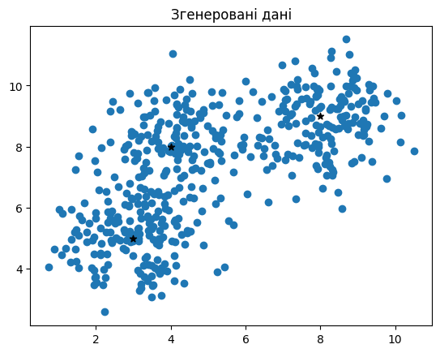
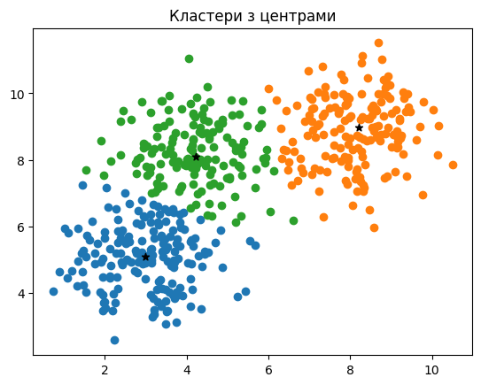
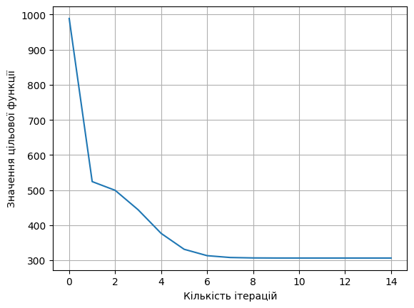

# Лабораторна робота №3. Нечітка кластеризація (Fuzzy C-Means)

**Мета роботи:** Розв’язати прикладну задачу кластеризації методом нечіткої логіки (FCM): знайти центри кластерів та проаналізувати збіжність за значенням цільової функції.

## Що зроблено
- Сформульовано прикладну постановку (сегментація музичних композицій за вектором ознак).
- Синтезовано двовимірні дані з трьома центрами та згенеровано вибірку.
- Застосовано Fuzzy C-Means (skfuzzy.cluster.cmeans): отримано матрицю приналежностей U та центри кластерів.
- Візуалізовано результат кластеризації (точки за домінуючим кластером) та центри кластерів.
- Побудовано графік зміни значень цільової функції Jm по ітераціях.

## Для чого це зроблено
- Нечітка кластеризація дозволяє об’єкту належати кільком кластерам з різними ступенями, що корисно при «розмитих» межах між класами.
- Графік Jm показує збіжність та стабілізацію процесу оптимізації.

## Результат
- Отримано центри кластерів, матрицю приналежності та графік збіжності Jm.


---


Музичні композиції можуть бути представлені у вигляді векторів ознак, що описують темп, спектральні характеристики, ритмічні патерни та інші аудіометричні параметри. Стрімінгові сервіси потребують автоматичної класифікації музики для формування плейлистів та рекомендацій. Завданням є побудова моделі, яка класифікує музичні треки за жанрами на основі їхніх ознак.


```python
import random


def genrand(n, i, j):
    rand_ints = random.sample(range(i, j + 1), n)
    return sorted(rand_ints)
```

Синтезуємо дані: 500 екземплярів, три центри. Дані задаються двовимірними векторами. 


```python
import numpy as np
import skfuzzy as fuzz
import matplotlib.pyplot as plt
from sklearn.datasets import make_blobs

min, max = 0, 10
centers = [genrand(2, min, max) for _ in range(3)]
data, _ = make_blobs(
    n_samples=500, centers=centers, random_state=random.randint(0, 1000)
)

print("Згенеровані центри:")
print(centers)

plt.scatter(data[:, 0], data[:, 1])
plt.title("Згенеровані дані")
for idx, coord in enumerate(centers):
    plt.scatter(*coord, marker="*", color="black")
plt.show()
```

    Згенеровані центри:
    [[3, 5], [4, 8], [8, 9]]
    


    

    


Далі застосую алгоритм нечіткої кластеризації fuzzy.cmeans. Вказую кількість кластерів – 3, отримую розподіл і візуалізую здійснену кластеризацію. Також окремо візуалізую центри кластерів чорними зірочками.


```python
center, u, u0, d, jm, p, fpc = fuzz.cluster.cmeans(
    data.T, 3, 3, error=0.005, maxiter=100
)
fuzzy_labels = np.argmax(u, axis=0)

for i in range(3):
    cluster_points = data[fuzzy_labels == i]
    plt.scatter(cluster_points[:, 0], cluster_points[:, 1])
print("Знайдені центри:")
print(center)

plt.scatter(center[:, 0], center[:, 1], marker="*", color="black")
plt.title("Кластери з центрами")
plt.show()
```

    Знайдені центри:
    [[2.99137724 5.09877687]
     [8.20014942 8.97406096]
     [4.2241724  8.11189092]]
    


    

    


Далі виводимо графік зміни значень цільової функції


```python
plt.plot(jm)
plt.xlabel("Кількість ітерацій")
plt.ylabel("Значення цільової функції")
plt.grid(True)
plt.show()
```


    

    


---


## Висновки
- FCM-алгоритм успішно розбив вибірку на кластери та показав збіжність за цільовою функцією.

