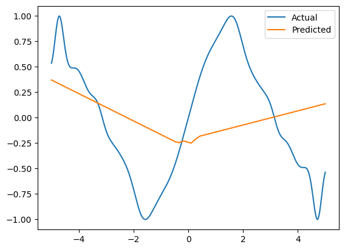
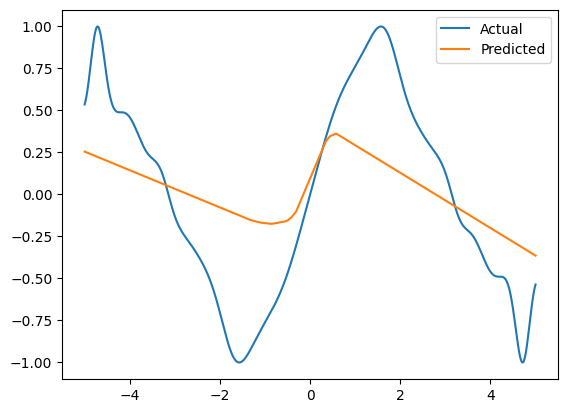
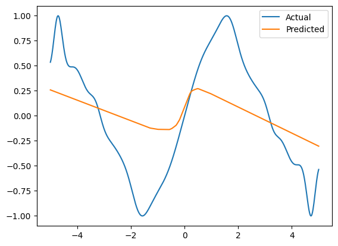
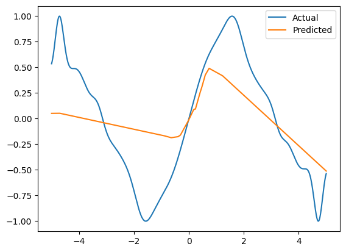
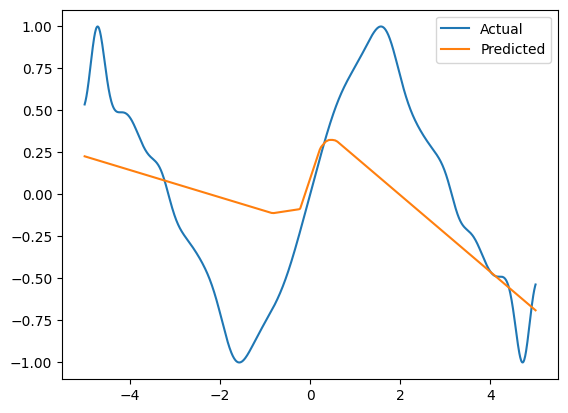
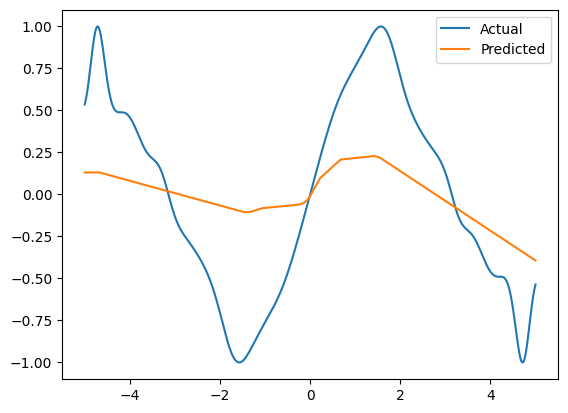

# Лабораторна робота №4. Моделювання функції нейронними мережами

**Мета роботи:** Дослідити вплив архітектури нейронної мережі (тип, кількість шарів і нейронів) на точність моделювання заданої функції.

## Що зроблено
- Згенеровано навчальні дані (x, z) для заданої функції; побудовано базову візуалізацію.
- Реалізовано єдину процедуру навчання/тестування, що будує графіки «Actual vs Predicted».
- Створено та порівняно 3 типи мереж: feedforward, cascade-forward та рекурентну Elman (SimpleRNN).
- Для кожного типу протестовано кілька конфігурацій (різна кількість шарів/нейронів) і візуально порівняно результати.

## Для чого це зроблено
- Архітектура мережі визначає здатність апроксимувати нелінійні залежності та узагальнювати дані.
- Порівняння типів мереж демонструє різницю між прямим поширенням і рекурентними структурами.

## Результат
- Отримано серії графіків прогнозу для різних архітектур та зроблено порівняння якості.


---


Для початку імпортуємо усі необхідні модулі, для x та y обираємо значення від -5 до 5, обраховуємо y та z за формулами відповідно до завдання.


```python
import numpy as np
import matplotlib.pyplot as plt
from keras.models import Sequential, Model
from keras.layers import Input, Dense, Concatenate, SimpleRNN, Reshape

x = np.linspace(-5, 5, 1000)
y = x * np.sin(x) * np.cos(x)
z = np.cos(np.sin(y)) * np.sin(x)
```

Оскільки будемо тестувати 6 різних нейронних мереж, то створюємо функцію з моделлю як параметром для навчання, тестування та візуалізації результату. Навчаємо модель на 20 епохах з розміром сегменту 100.


```python
def modelTesting(model):
    model.compile(optimizer="adam", loss="mse")
    model.fit(x, z, epochs=20, batch_size=100)
    z_pred = model.predict(x)

    plt.plot(x, z, label="Actual")
    plt.plot(x, z_pred, label="Predicted")
    plt.legend()
    plt.show()
```

Створюємо мережу feedforward backprop. Відповідно маємо sequential модель з кількома щільними шарами Dense, кількість шарів задається. Вихідний шар також Dense з 1 нейроном:


```python
def feedforwardCreation(layers, neurons):
    model = Sequential()
    model.add(Input(shape=(1,)))
    for i in range(layers):
        model.add(Dense(neurons, activation="relu"))
    model.add(Dense(1, name="output"))
    return model
```

Наступною створюємо cascadeforward backprop. Відповідно створюємо вхідний шар, за ним створюю Dense, пов’язаний з вхідним. І далі відповідно до кількості шарів створюю наступні шари, які за допомогою Concatenate пов’язані з усіма попередніми. 


```python
def cascadeforwardCreation(layers, neurons):
    inputLayer = Input(shape=(1,), name="input")
    current = Dense(neurons, activation="relu")(inputLayer)
    for i in range(layers - 1):
        concatenatedLayer = Concatenate()([inputLayer, current])
        current = Dense(neurons, activation="relu")(concatenatedLayer)
    outputLayer = Dense(1, name="output")(current)
    model = Model(inputs=inputLayer, outputs=outputLayer)
    return model
```

Останньою мережею створюємо Elman backprop. Мережа Elman схожа на feedforward, але з додаванням контекстного шару. Контекстний шар отримує дані від прихованого шару і, у свою чергу, передає свій вихід назад у прихований шар. Ця зворотна петля надає мережі форму пам'яті.


```python
def elmanCreation(layers, neurons):
    model = Sequential()
    model.add(Input(shape=(1,)))
    model.add(Reshape((1, 1), name="input_reshape"))
    for i in range(layers):
        model.add(SimpleRNN(neurons, return_sequences=True, activation="relu"))
    model.add(Dense(1, name="output"))
    model.add(Reshape((1,), name="output_reshape"))
    return model
```

Далі створюємо власні мережі відповідно до завдання. У кожній мережі перший параметр – кількість шарів, другий – кількість нейронів у шарі.


```python
f1 = feedforwardCreation(1, 10)
f2 = feedforwardCreation(1, 20)

c1 = cascadeforwardCreation(1, 20)
c2 = cascadeforwardCreation(2, 10)

e1 = elmanCreation(1, 15)
e2 = elmanCreation(3, 5)

modelTesting(f1)
modelTesting(f2)

modelTesting(c1)
modelTesting(c2)

modelTesting(e1)
modelTesting(e2)
```

    Epoch 1/20
	10/10 ━━━━━━━━━━━━━━━━━━━━ 1s 4ms/step - loss: 2.3606 
    10/10 ━━━━━━━━━━━━━━━━━━━━ 1s 4ms/step - loss: 2.3606  
    Epoch 2/20
    10/10 ━━━━━━━━━━━━━━━━━━━━ 0s 3ms/step - loss: 2.0161 
    Epoch 3/20
    10/10 ━━━━━━━━━━━━━━━━━━━━ 0s 3ms/step - loss: 1.7190 
    Epoch 4/20
    10/10 ━━━━━━━━━━━━━━━━━━━━ 0s 3ms/step - loss: 1.4602 
    Epoch 5/20
    10/10 ━━━━━━━━━━━━━━━━━━━━ 0s 3ms/step - loss: 1.2396 
    Epoch 6/20
    10/10 ━━━━━━━━━━━━━━━━━━━━ 0s 3ms/step - loss: 1.0563 
    Epoch 7/20
    10/10 ━━━━━━━━━━━━━━━━━━━━ 0s 3ms/step - loss: 0.9048 
    Epoch 8/20
    10/10 ━━━━━━━━━━━━━━━━━━━━ 0s 3ms/step - loss: 0.7772 
    Epoch 9/20
    10/10 ━━━━━━━━━━━━━━━━━━━━ 0s 3ms/step - loss: 0.6807 
    Epoch 10/20
    10/10 ━━━━━━━━━━━━━━━━━━━━ 0s 3ms/step - loss: 0.5973 
    Epoch 11/20
    10/10 ━━━━━━━━━━━━━━━━━━━━ 0s 3ms/step - loss: 0.5352 
    Epoch 12/20
    10/10 ━━━━━━━━━━━━━━━━━━━━ 0s 3ms/step - loss: 0.4865 
    Epoch 13/20
    10/10 ━━━━━━━━━━━━━━━━━━━━ 0s 3ms/step - loss: 0.4505 
    Epoch 14/20
    10/10 ━━━━━━━━━━━━━━━━━━━━ 0s 3ms/step - loss: 0.4218 
    Epoch 15/20
    10/10 ━━━━━━━━━━━━━━━━━━━━ 0s 3ms/step - loss: 0.4013 
    Epoch 16/20
    10/10 ━━━━━━━━━━━━━━━━━━━━ 0s 3ms/step - loss: 0.3847 
    Epoch 17/20
    10/10 ━━━━━━━━━━━━━━━━━━━━ 0s 3ms/step - loss: 0.3732 
    Epoch 18/20
    10/10 ━━━━━━━━━━━━━━━━━━━━ 0s 3ms/step - loss: 0.3638 
    Epoch 19/20
    10/10 ━━━━━━━━━━━━━━━━━━━━ 0s 3ms/step - loss: 0.3564 
    Epoch 20/20
    10/10 ━━━━━━━━━━━━━━━━━━━━ 0s 3ms/step - loss: 0.3495 
    32/32 ━━━━━━━━━━━━━━━━━━━━ 0s 2ms/step 
    


    

    


    Epoch 1/20
    10/10 ━━━━━━━━━━━━━━━━━━━━ 1s 3ms/step - loss: 0.8190  
    Epoch 2/20
    10/10 ━━━━━━━━━━━━━━━━━━━━ 0s 3ms/step - loss: 0.6675 
    Epoch 3/20
    10/10 ━━━━━━━━━━━━━━━━━━━━ 0s 3ms/step - loss: 0.5650 
    Epoch 4/20
    10/10 ━━━━━━━━━━━━━━━━━━━━ 0s 3ms/step - loss: 0.4853 
    Epoch 5/20
    10/10 ━━━━━━━━━━━━━━━━━━━━ 0s 3ms/step - loss: 0.4222 
    Epoch 6/20
    10/10 ━━━━━━━━━━━━━━━━━━━━ 0s 3ms/step - loss: 0.3730 
    Epoch 7/20
    10/10 ━━━━━━━━━━━━━━━━━━━━ 0s 4ms/step - loss: 0.3354 
    Epoch 8/20
    10/10 ━━━━━━━━━━━━━━━━━━━━ 0s 4ms/step - loss: 0.3071 
    Epoch 9/20
    10/10 ━━━━━━━━━━━━━━━━━━━━ 0s 3ms/step - loss: 0.2859 
    Epoch 10/20
    10/10 ━━━━━━━━━━━━━━━━━━━━ 0s 3ms/step - loss: 0.2702 
    Epoch 11/20
    10/10 ━━━━━━━━━━━━━━━━━━━━ 0s 4ms/step - loss: 0.2581 
    Epoch 12/20
    10/10 ━━━━━━━━━━━━━━━━━━━━ 0s 3ms/step - loss: 0.2487 
    Epoch 13/20
    10/10 ━━━━━━━━━━━━━━━━━━━━ 0s 3ms/step - loss: 0.2408 
    Epoch 14/20
    10/10 ━━━━━━━━━━━━━━━━━━━━ 0s 3ms/step - loss: 0.2340 
    Epoch 15/20
    10/10 ━━━━━━━━━━━━━━━━━━━━ 0s 3ms/step - loss: 0.2278 
    Epoch 16/20
    10/10 ━━━━━━━━━━━━━━━━━━━━ 0s 3ms/step - loss: 0.2221 
    Epoch 17/20
    10/10 ━━━━━━━━━━━━━━━━━━━━ 0s 3ms/step - loss: 0.2168 
    Epoch 18/20
    10/10 ━━━━━━━━━━━━━━━━━━━━ 0s 3ms/step - loss: 0.2111 
    Epoch 19/20
    10/10 ━━━━━━━━━━━━━━━━━━━━ 0s 4ms/step - loss: 0.2062 
    Epoch 20/20
    10/10 ━━━━━━━━━━━━━━━━━━━━ 0s 3ms/step - loss: 0.2009 
    32/32 ━━━━━━━━━━━━━━━━━━━━ 0s 3ms/step
    


    

    


    Epoch 1/20
    10/10 ━━━━━━━━━━━━━━━━━━━━ 1s 3ms/step - loss: 1.0248  
    Epoch 2/20
    10/10 ━━━━━━━━━━━━━━━━━━━━ 0s 3ms/step - loss: 0.7252 
    Epoch 3/20
    10/10 ━━━━━━━━━━━━━━━━━━━━ 0s 3ms/step - loss: 0.5211 
    Epoch 4/20
    10/10 ━━━━━━━━━━━━━━━━━━━━ 0s 3ms/step - loss: 0.3926 
    Epoch 5/20
    10/10 ━━━━━━━━━━━━━━━━━━━━ 0s 3ms/step - loss: 0.3269 
    Epoch 6/20
    10/10 ━━━━━━━━━━━━━━━━━━━━ 0s 3ms/step - loss: 0.2987 
    Epoch 7/20
    10/10 ━━━━━━━━━━━━━━━━━━━━ 0s 4ms/step - loss: 0.2876 
    Epoch 8/20
    10/10 ━━━━━━━━━━━━━━━━━━━━ 0s 3ms/step - loss: 0.2821 
    Epoch 9/20
    10/10 ━━━━━━━━━━━━━━━━━━━━ 0s 3ms/step - loss: 0.2778 
    Epoch 10/20
    10/10 ━━━━━━━━━━━━━━━━━━━━ 0s 3ms/step - loss: 0.2737 
    Epoch 11/20
    10/10 ━━━━━━━━━━━━━━━━━━━━ 0s 3ms/step - loss: 0.2692 
    Epoch 12/20
    10/10 ━━━━━━━━━━━━━━━━━━━━ 0s 4ms/step - loss: 0.2648 
    Epoch 13/20
    10/10 ━━━━━━━━━━━━━━━━━━━━ 0s 4ms/step - loss: 0.2602 
    Epoch 14/20
    10/10 ━━━━━━━━━━━━━━━━━━━━ 0s 4ms/step - loss: 0.2555 
    Epoch 15/20
    10/10 ━━━━━━━━━━━━━━━━━━━━ 0s 3ms/step - loss: 0.2508 
    Epoch 16/20
    10/10 ━━━━━━━━━━━━━━━━━━━━ 0s 4ms/step - loss: 0.2460 
    Epoch 17/20
    10/10 ━━━━━━━━━━━━━━━━━━━━ 0s 4ms/step - loss: 0.2412 
    Epoch 18/20
    10/10 ━━━━━━━━━━━━━━━━━━━━ 0s 4ms/step - loss: 0.2362 
    Epoch 19/20
    10/10 ━━━━━━━━━━━━━━━━━━━━ 0s 4ms/step - loss: 0.2313 
    Epoch 20/20
    10/10 ━━━━━━━━━━━━━━━━━━━━ 0s 6ms/step - loss: 0.2262 
    32/32 ━━━━━━━━━━━━━━━━━━━━ 0s 2ms/step
    


    

    


    Epoch 1/20
    10/10 ━━━━━━━━━━━━━━━━━━━━ 1s 3ms/step - loss: 0.7347  
    Epoch 2/20
    10/10 ━━━━━━━━━━━━━━━━━━━━ 0s 3ms/step - loss: 0.5605 
    Epoch 3/20
    10/10 ━━━━━━━━━━━━━━━━━━━━ 0s 3ms/step - loss: 0.4562 
    Epoch 4/20
    10/10 ━━━━━━━━━━━━━━━━━━━━ 0s 3ms/step - loss: 0.4135 
    Epoch 5/20
    10/10 ━━━━━━━━━━━━━━━━━━━━ 0s 3ms/step - loss: 0.3889 
    Epoch 6/20
    10/10 ━━━━━━━━━━━━━━━━━━━━ 0s 4ms/step - loss: 0.3673 
    Epoch 7/20
    10/10 ━━━━━━━━━━━━━━━━━━━━ 0s 4ms/step - loss: 0.3518 
    Epoch 8/20
    10/10 ━━━━━━━━━━━━━━━━━━━━ 0s 4ms/step - loss: 0.3382 
    Epoch 9/20
    10/10 ━━━━━━━━━━━━━━━━━━━━ 0s 4ms/step - loss: 0.3267 
    Epoch 10/20
    10/10 ━━━━━━━━━━━━━━━━━━━━ 0s 4ms/step - loss: 0.3149 
    Epoch 11/20
    10/10 ━━━━━━━━━━━━━━━━━━━━ 0s 4ms/step - loss: 0.3026 
    Epoch 12/20
    10/10 ━━━━━━━━━━━━━━━━━━━━ 0s 4ms/step - loss: 0.2899 
    Epoch 13/20
    10/10 ━━━━━━━━━━━━━━━━━━━━ 0s 4ms/step - loss: 0.2770 
    Epoch 14/20
    10/10 ━━━━━━━━━━━━━━━━━━━━ 0s 4ms/step - loss: 0.2627 
    Epoch 15/20
    10/10 ━━━━━━━━━━━━━━━━━━━━ 0s 5ms/step - loss: 0.2485 
    Epoch 16/20
    10/10 ━━━━━━━━━━━━━━━━━━━━ 0s 4ms/step - loss: 0.2343 
    Epoch 17/20
    10/10 ━━━━━━━━━━━━━━━━━━━━ 0s 4ms/step - loss: 0.2206 
    Epoch 18/20
    10/10 ━━━━━━━━━━━━━━━━━━━━ 0s 3ms/step - loss: 0.2104 
    Epoch 19/20
    10/10 ━━━━━━━━━━━━━━━━━━━━ 0s 10ms/step - loss: 0.2001
    Epoch 20/20
    10/10 ━━━━━━━━━━━━━━━━━━━━ 0s 4ms/step - loss: 0.1899 
    32/32 ━━━━━━━━━━━━━━━━━━━━ 0s 3ms/step
    


    

    


    Epoch 1/20
    10/10 ━━━━━━━━━━━━━━━━━━━━ 1s 4ms/step - loss: 3.9834
    Epoch 2/20
    10/10 ━━━━━━━━━━━━━━━━━━━━ 0s 4ms/step - loss: 3.3265 
    Epoch 3/20
    10/10 ━━━━━━━━━━━━━━━━━━━━ 0s 4ms/step - loss: 2.7457 
    Epoch 4/20
    10/10 ━━━━━━━━━━━━━━━━━━━━ 0s 4ms/step - loss: 2.2666 
    Epoch 5/20
    10/10 ━━━━━━━━━━━━━━━━━━━━ 0s 4ms/step - loss: 1.8593 
    Epoch 6/20
    10/10 ━━━━━━━━━━━━━━━━━━━━ 0s 4ms/step - loss: 1.5284 
    Epoch 7/20
    10/10 ━━━━━━━━━━━━━━━━━━━━ 0s 4ms/step - loss: 1.2582 
    Epoch 8/20
    10/10 ━━━━━━━━━━━━━━━━━━━━ 0s 4ms/step - loss: 1.0400 
    Epoch 9/20
    10/10 ━━━━━━━━━━━━━━━━━━━━ 0s 4ms/step - loss: 0.8638 
    Epoch 10/20
    10/10 ━━━━━━━━━━━━━━━━━━━━ 0s 4ms/step - loss: 0.7206 
    Epoch 11/20
    10/10 ━━━━━━━━━━━━━━━━━━━━ 0s 4ms/step - loss: 0.6094 
    Epoch 12/20
    10/10 ━━━━━━━━━━━━━━━━━━━━ 0s 4ms/step - loss: 0.5179 
    Epoch 13/20
    10/10 ━━━━━━━━━━━━━━━━━━━━ 0s 4ms/step - loss: 0.4478 
    Epoch 14/20
    10/10 ━━━━━━━━━━━━━━━━━━━━ 0s 5ms/step - loss: 0.3920 
    Epoch 15/20
    10/10 ━━━━━━━━━━━━━━━━━━━━ 0s 5ms/step - loss: 0.3483 
    Epoch 16/20
    10/10 ━━━━━━━━━━━━━━━━━━━━ 0s 4ms/step - loss: 0.3144 
    Epoch 17/20
    10/10 ━━━━━━━━━━━━━━━━━━━━ 0s 4ms/step - loss: 0.2883 
    Epoch 18/20
    10/10 ━━━━━━━━━━━━━━━━━━━━ 0s 5ms/step - loss: 0.2678 
    Epoch 19/20
    10/10 ━━━━━━━━━━━━━━━━━━━━ 0s 4ms/step - loss: 0.2525 
    Epoch 20/20
    10/10 ━━━━━━━━━━━━━━━━━━━━ 0s 4ms/step - loss: 0.2405 
    32/32 ━━━━━━━━━━━━━━━━━━━━ 0s 7ms/step
    


    

    


    Epoch 1/20
    10/10 ━━━━━━━━━━━━━━━━━━━━ 3s 4ms/step - loss: 0.3751
    Epoch 2/20
    10/10 ━━━━━━━━━━━━━━━━━━━━ 0s 4ms/step - loss: 0.3641 
    Epoch 3/20
    10/10 ━━━━━━━━━━━━━━━━━━━━ 0s 4ms/step - loss: 0.3558 
    Epoch 4/20
    10/10 ━━━━━━━━━━━━━━━━━━━━ 0s 5ms/step - loss: 0.3477 
    Epoch 5/20
    10/10 ━━━━━━━━━━━━━━━━━━━━ 0s 5ms/step - loss: 0.3404 
    Epoch 6/20
    10/10 ━━━━━━━━━━━━━━━━━━━━ 0s 5ms/step - loss: 0.3336 
    Epoch 7/20
    10/10 ━━━━━━━━━━━━━━━━━━━━ 0s 5ms/step - loss: 0.3280 
    Epoch 8/20
    10/10 ━━━━━━━━━━━━━━━━━━━━ 0s 5ms/step - loss: 0.3225 
    Epoch 9/20
    10/10 ━━━━━━━━━━━━━━━━━━━━ 0s 6ms/step - loss: 0.3167 
    Epoch 10/20
    10/10 ━━━━━━━━━━━━━━━━━━━━ 0s 6ms/step - loss: 0.3108 
    Epoch 11/20
    10/10 ━━━━━━━━━━━━━━━━━━━━ 0s 6ms/step - loss: 0.3046 
    Epoch 12/20
    10/10 ━━━━━━━━━━━━━━━━━━━━ 0s 6ms/step - loss: 0.2982 
    Epoch 13/20
    10/10 ━━━━━━━━━━━━━━━━━━━━ 0s 5ms/step - loss: 0.2915 
    Epoch 14/20
    10/10 ━━━━━━━━━━━━━━━━━━━━ 0s 6ms/step - loss: 0.2839 
    Epoch 15/20
    10/10 ━━━━━━━━━━━━━━━━━━━━ 0s 6ms/step - loss: 0.2765 
    Epoch 16/20
    10/10 ━━━━━━━━━━━━━━━━━━━━ 0s 5ms/step - loss: 0.2681 
    Epoch 17/20
    10/10 ━━━━━━━━━━━━━━━━━━━━ 0s 5ms/step - loss: 0.2595 
    Epoch 18/20
    10/10 ━━━━━━━━━━━━━━━━━━━━ 0s 5ms/step - loss: 0.2503 
    Epoch 19/20
    10/10 ━━━━━━━━━━━━━━━━━━━━ 0s 5ms/step - loss: 0.2404 
    Epoch 20/20
    10/10 ━━━━━━━━━━━━━━━━━━━━ 0s 5ms/step - loss: 0.2302 
    32/32 ━━━━━━━━━━━━━━━━━━━━ 1s 13ms/step
    


    

    


---


## Висновки
- Показано, що збільшення потужності моделі (шари/нейрони) та вибір архітектури суттєво впливають на точність апроксимації.

