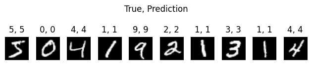
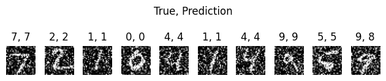

# Лабораторна робота №5. Згорткова нейронна мережа для MNIST

**Мета роботи:** Побудувати, навчити та перевірити згорткову нейронну мережу (CNN) для розпізнавання рукописних цифр MNIST.

## Що зроблено
- Завантажено датасет MNIST, виконано нормалізацію та перетворення формату (28×28×1), мітки переведено у one-hot.
- Побудовано CNN на Keras (Conv2D + MaxPooling2D + Flatten + Dense) та скомпільовано модель.
- Навчено модель на тренувальній вибірці та оцінено якість на тестовій.
- Продемонстровано роботу мережі на прикладах: (а) зображення з тренувальної вибірки; (б) «зашумлені» зображення, щоб перевірити стійкість до спотворень.

## Для чого це зроблено
- CNN ефективні для задач комп’ютерного зору, бо автоматично виділяють локальні ознаки (фільтри) та зменшують розмірність через pooling.
- Перевірка на зашумлених зображеннях показує практичну надійність моделі.

## Результат
- Отримано навчений класифікатор MNIST та приклади прогнозів для нормальних і зашумлених зображень.


---


```python
import os
import warnings

os.environ["TF_CPP_MIN_LOG_LEVEL"] = "3"
warnings.filterwarnings("ignore")

import numpy as np
import matplotlib.pyplot as plt
from tensorflow.keras.datasets import mnist
from tensorflow.keras.models import Sequential
from tensorflow.keras.layers import Conv2D, MaxPooling2D, Flatten, Dense
from tensorflow.keras.utils import to_categorical
```


```python
model = Sequential(
    [
        Conv2D(32, (3, 3), activation="relu", input_shape=(28, 28, 1)),
        MaxPooling2D((2, 2)),
        Conv2D(64, (3, 3), activation="relu"),
        MaxPooling2D((2, 2)),
        Flatten(),
        Dense(128, activation="relu"),
        Dense(10, activation="softmax"),
    ]
)

model.compile(optimizer="adam", loss="categorical_crossentropy", metrics=["accuracy"])
```


```python
(x_train, y_train), (x_test, y_test) = mnist.load_data()
x_train = x_train.reshape((-1, 28, 28, 1)) / 255.0
x_test = x_test.reshape((-1, 28, 28, 1)) / 255.0
y_train_cat = to_categorical(y_train, 10)
y_test_cat = to_categorical(y_test, 10)

model.fit(x_train, y_train_cat, epochs=5, batch_size=128, validation_split=0.1)
```

    Epoch 1/5
    422/422 ━━━━━━━━━━━━━━━━━━━━ 13s 28ms/step - accuracy: 0.9355 - loss: 0.2239 - val_accuracy: 0.9810 - val_loss: 0.0671
    Epoch 2/5
    422/422 ━━━━━━━━━━━━━━━━━━━━ 11s 27ms/step - accuracy: 0.9813 - loss: 0.0620 - val_accuracy: 0.9845 - val_loss: 0.0523
    Epoch 3/5
    422/422 ━━━━━━━━━━━━━━━━━━━━ 11s 26ms/step - accuracy: 0.9871 - loss: 0.0424 - val_accuracy: 0.9883 - val_loss: 0.0409
    Epoch 4/5
    422/422 ━━━━━━━━━━━━━━━━━━━━ 11s 26ms/step - accuracy: 0.9899 - loss: 0.0320 - val_accuracy: 0.9890 - val_loss: 0.0414
    Epoch 5/5
    422/422 ━━━━━━━━━━━━━━━━━━━━ 11s 26ms/step - accuracy: 0.9927 - loss: 0.0237 - val_accuracy: 0.9897 - val_loss: 0.0360
    


    <keras.src.callbacks.history.History at 0x19afb417350>


```python
print("Predictions on training images:")

imgs = []
titles = []
for i in range(10):
    img = x_train[i]
    true = y_train[i]
    pred = np.argmax(model.predict(img.reshape(1, 28, 28, 1)))
    imgs.append(img.squeeze())
    titles.append(f"{true}, {pred}")

fig, axes = plt.subplots(1, 10)
for ax, img, title in zip(axes, imgs, titles):
	ax.imshow(img, cmap="gray")
	ax.set_title(title)
	ax.axis("off")
plt.suptitle("True, Prediction", y=0.65)
plt.tight_layout()
plt.show()
```

    Predictions on training images:
    1/1 ━━━━━━━━━━━━━━━━━━━━ 0s 200ms/step
    1/1 ━━━━━━━━━━━━━━━━━━━━ 0s 45ms/step
    1/1 ━━━━━━━━━━━━━━━━━━━━ 0s 42ms/step
    1/1 ━━━━━━━━━━━━━━━━━━━━ 0s 42ms/step
    1/1 ━━━━━━━━━━━━━━━━━━━━ 0s 39ms/step
    1/1 ━━━━━━━━━━━━━━━━━━━━ 0s 37ms/step
    1/1 ━━━━━━━━━━━━━━━━━━━━ 0s 40ms/step
    1/1 ━━━━━━━━━━━━━━━━━━━━ 0s 38ms/step
    1/1 ━━━━━━━━━━━━━━━━━━━━ 0s 40ms/step
    1/1 ━━━━━━━━━━━━━━━━━━━━ 0s 40ms/step
    


    

    


```python
print("Predictions on noisy images:")
imgs = []
titles = []
for i in range(10):
    img = x_test[i]
    noisy_img = img + 0.5 * np.random.normal(loc=0.0, scale=1.0, size=img.shape)
    noisy_img = np.clip(noisy_img, 0.0, 1.0)
    true = y_test[i]
    pred = np.argmax(model.predict(noisy_img.reshape(1, 28, 28, 1)))
    imgs.append(noisy_img.squeeze())
    titles.append(f"{true}, {pred}")

fig, axes = plt.subplots(1, 10)
for ax, img, title in zip(axes, imgs, titles):
    ax.imshow(img, cmap="gray")
    ax.set_title(title)
    ax.axis("off")
plt.suptitle("True, Prediction", y=0.65)
plt.tight_layout()
plt.show()
```

    Predictions on noisy images:
    1/1 ━━━━━━━━━━━━━━━━━━━━ 0s 37ms/step
    1/1 ━━━━━━━━━━━━━━━━━━━━ 0s 34ms/step
    1/1 ━━━━━━━━━━━━━━━━━━━━ 0s 36ms/step
    1/1 ━━━━━━━━━━━━━━━━━━━━ 0s 38ms/step
    1/1 ━━━━━━━━━━━━━━━━━━━━ 0s 36ms/step
    1/1 ━━━━━━━━━━━━━━━━━━━━ 0s 35ms/step
    1/1 ━━━━━━━━━━━━━━━━━━━━ 0s 38ms/step
    1/1 ━━━━━━━━━━━━━━━━━━━━ 0s 34ms/step
    1/1 ━━━━━━━━━━━━━━━━━━━━ 0s 34ms/step
    1/1 ━━━━━━━━━━━━━━━━━━━━ 0s 35ms/step
    


    

    


---


## Висновки
- Побудована CNN успішно виконує класифікацію цифр; додаткові тести показали зниження якості при шумі, але модель зберігає працездатність.

