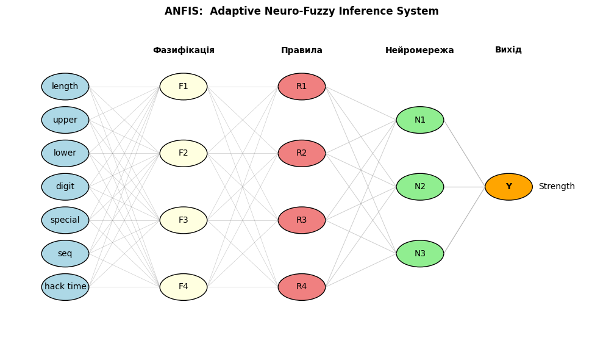

# Лабораторна робота №6. Нейро-нечітке моделювання (гібридні мережі)

**Мета роботи:** Закріпити знання про нейро-нечіткі (гібридні) системи та отримати практичні навички побудови/навчання моделі типу Sugeno/ANFIS для прикладної задачі.

## Що зроблено
- Сформульовано прикладну задачу: оцінювання складності/надійності паролів на основі набору ознак.
- Зібрано та об’єднано навчальні дані з CSV (weak/average/strong) та сформовано цільову змінну (клас складності).
- Реалізовано виділення ознак (довжина, наявність великих/малих літер, цифр, спецсимволів тощо) для побудови навчальної вибірки.
- Побудовано схему (візуалізацію) архітектури гібридної нейро-нечіткої мережі (ANFIS) з шарами фазифікації, правил, нормалізації та агрегування.
- Навчено модель на підготовлених даних і підготовлено блоки для перевірки адекватності на прикладах.

## Для чого це зроблено
- Гібридні нейро-нечіткі системи поєднують інтерпретованість правил нечіткої логіки та здатність нейромереж автоматично підлаштовувати параметри.
- Ознаки паролів — приклад «слабко формалізованої» області, де нечіткі правила можуть бути зрозумілими людині.

## Результат
- Отримано навчений прототип моделі для класифікації складності паролів та структурну схему ANFIS.


---


### 1. Сформулювати завдання в галузі обчислювальної техніки, для вирішення якої було б обґрунтовано застосування гібридної нейронечіткої мережі.

**Завдання:**  
Розробка системи оцінювання надійності паролів користувачів для інформаційних систем, яка враховує як формальні характеристики пароля (довжина, наявність цифр, спеціальних символів, регістрів, послідовностей тощо), так і нечіткі експертні правила (наприклад, "пароль занадто схожий на слово зі словника" або "пароль містить підозрілу послідовність символів").  

Завдання характеризується наявністю як чітких числових ознак, так і нечітких, експертних критеріїв, що складно формалізуються. Гібридна нейронечітка мережа (наприклад, ANFIS) дозволяє поєднати можливості нечіткої логіки для роботи з експертними правилами та нейронних мереж для автоматичного навчання на основі даних, забезпечуючи гнучкість і високу якість класифікації складності паролів.


```python
import pandas as pd

df_weak = pd.read_csv("pswds/weak.csv", nrows=1000)
df_average = pd.read_csv("pswds/average.csv", nrows=1000)
df_strong = pd.read_csv("pswds/strong.csv", nrows=1000)
df = pd.concat([df_weak, df_average, df_strong], ignore_index=True)
df.head()
```


|   | Password        | Strength_Level |
|---|-----------------|---------------|
| 0 | Activate9999    | 1             |
| 1 | bbbbadjurer4    | 1             |
| 2 | asdfadinole5    | 1             |
| 3 | acetoinAsdf     | 1             |
| 4 | qweabsurdly3    | 1             |


### 2. Формування вибірки для навчання гібридної нейронної мережі.

Для навчання гібридної нейронної мережі (ANFIS) сформуємо вибірку з ознак, що характеризують паролі, та цільової змінної — рівня складності пароля.

**Ознаки (фічі):**
- length — довжина пароля
- has_upper — наявність великих літер
- has_lower — наявність малих літер
- has_digit — наявність цифр
- has_special — наявність спеціальних символів
- has_seq — наявність підозрілих послідовностей
- maxHackTimeH — оцінка часу злому (години)

**Цільова змінна:**
- Strength_Level — рівень складності пароля (1 — слабкий, 2 — середній, 3 — сильний)

**Формування вибірки:**

```python
features = ['length', 'has_upper', 'has_lower', 'has_digit', 'has_special', 'has_seq', 'maxHackTimeH']
X = df[features]
y = df['Strength_Level']
```

Тепер `X` — матриця ознак, а `y` — цільова змінна для навчання моделі.


```python
def addInfo(pswd):
    length = len(pswd)
    has_upper = any(c.isupper() for c in pswd)
    has_lower = any(c.islower() for c in pswd)
    has_digit = any(c.isdigit() for c in pswd)
    has_special = any(not c.isalnum() for c in pswd)

    with open("seq.txt", "r") as f:
        sequences = [line.strip() for line in f if line.strip()]

    has_seq = any(seq in pswd for seq in sequences)

    base = (
        (26 if has_lower else 0)
        + (26 if has_upper else 0)
        + (10 if has_digit else 0)
        + (10 if has_special else 0)
    )
    pswd_hour = 1_000_000_000 * 360
    maxHackTimeH = (base**length) / pswd_hour

    return [
        length,
        has_upper,
        has_lower,
        has_digit,
        has_special,
        has_seq,
        int(round(maxHackTimeH)),
    ]


df[
    [
        "length",
        "has_upper",
        "has_lower",
        "has_digit",
        "has_special",
        "has_seq",
        "maxHackTimeH",
    ]
] = df["Password"].apply(lambda x: pd.Series(addInfo(x)))
df.head()
```


|   | Password        | Strength_Level | length | has_upper | has_lower | has_digit | has_special | has_seq | maxHackTimeH |
|---|-----------------|---------------|--------|-----------|-----------|-----------|-------------|---------|--------------|
| 0 | Activate9999    | 1             | 12     | True      | True      | True      | False       | True    | 8961852118   |
| 1 | bbbbadjurer4    | 1             | 12     | False     | True      | True      | False       | False   | 13162170     |
| 2 | asdfadinole5    | 1             | 12     | False     | True      | True      | False       | True    | 13162170     |
| 3 | acetoinAsdf     | 1             | 11     | True      | True      | False     | False       | False   | 20880182     |
| 4 | qweabsurdly3    | 1             | 12     | False     | True      | True      | False       | False   | 13162170     |


### 3. Структура гібридної нейронної мережі.

**Візуалізація структури гібридної нейронечіткої мережі (ANFIS)**

На діаграмі нижче зображено архітектуру ANFIS для задачі класифікації складності паролів:

- **Вхідні ознаки:**  
	- length (довжина)
	- upper (наявність великих літер)
	- lower (наявність малих літер)
	- digit (наявність цифр)
	- special (наявність спецсимволів)
	- seq (наявність підозрілих послідовностей)
	- hack time (оцінка часу злому)

- **Фазифікація:**  
	Кожна ознака перетворюється у нечіткі множини (F1–F4).

- **Правила:**  
	Формуються експертні та навчувані правила (R1–R4), що поєднують фазифіковані ознаки.

- **Нейромережа:**  
	Нейронні вузли (N1–N3) виконують агрегацію та навчання ваг.

- **Вихід:**  
	Остаточна оцінка складності пароля (Strength).


```python
import matplotlib.pyplot as plt
import matplotlib.patches as patches

fig, ax = plt.subplots(figsize=(10, 6))
ax.set_xlim(0, 10)
ax.set_ylim(0, 10)
ax.axis("off")

RADIUS = 0.4

inputs = ["length", "upper", "lower", "digit", "special", "seq", "hack time"]
y_pos = 8
for i, inp in enumerate(inputs):
    y = y_pos - i
    ax.add_patch(patches.Circle((1, y), RADIUS, color="lightblue", ec="black"))
    ax.text(1, y, inp, fontsize=10, va="center", ha="center")

ax.text(3, 9, "Фазифікація", fontsize=10, weight="bold", ha="center")
fuzz_y = [8, 6, 4, 2]
for i, y in enumerate(fuzz_y):
    ax.add_patch(patches.Circle((3, y), RADIUS, color="lightyellow", ec="black"))
    ax.text(3, y, f"F{i+1}", fontsize=10, va="center", ha="center")

ax.text(5, 9, "Правила", fontsize=10, weight="bold", ha="center")
rules_y = [8, 6, 4, 2]
for i, y in enumerate(rules_y):
    ax.add_patch(patches.Circle((5, y), RADIUS, color="lightcoral", ec="black"))
    ax.text(5, y, f"R{i+1}", fontsize=10, va="center", ha="center")

ax.text(7, 9, "Нейромережа", fontsize=10, weight="bold", ha="center")
nn_y = [7, 5, 3]
for i, y in enumerate(nn_y):
    ax.add_patch(patches.Circle((7, y), RADIUS, color="lightgreen", ec="black"))
    ax.text(7, y, f"N{i+1}", fontsize=10, va="center", ha="center")

ax.text(8.5, 9, "Вихід", fontsize=10, weight="bold", ha="center")
ax.add_patch(patches.Circle((8.5, 5), RADIUS, color="orange", ec="black"))
ax.text(8.5, 5, "Y", fontsize=10, va="center", ha="center", weight="bold")
ax.text(9, 5, "Strength", fontsize=10, va="center")

for i in range(len(inputs)):
    y1 = y_pos - i
    for y2 in fuzz_y:
        ax.plot([1 + RADIUS, 3 - RADIUS], [y1, y2], "gray", lw=0.5, alpha=0.4)

for y1 in fuzz_y:
    for y2 in rules_y:
        ax.plot([3 + RADIUS, 5 - RADIUS], [y1, y2], "gray", lw=0.5, alpha=0.4)

for y1 in rules_y:
    for y2 in nn_y:
        ax.plot([5 + RADIUS, 7 - RADIUS], [y1, y2], "gray", lw=0.7, alpha=0.4)

for y1 in nn_y:
    ax.plot([7 + RADIUS, 8.5 - RADIUS], [y1, 5], "gray", lw=0.8, alpha=0.6)

plt.title("ANFIS:  Adaptive Neuro-Fuzzy Inference System", fontsize=12, weight="bold")
plt.tight_layout()
plt.show()
```


    

    


### 4. Навчання гібридної нейронної мережі

Побудуємо та навчимо нейронну мережу за допомогою бібліотеки **TensorFlow**. Мережа буде апроксимувати залежність між характеристиками пароля та його складністю.


```python
import os
import warnings

os.environ["TF_CPP_MIN_LOG_LEVEL"] = "3"
warnings.filterwarnings("ignore")
```


```python
import numpy as np
import tensorflow as tf
from sklearn.model_selection import train_test_split
from sklearn.preprocessing import StandardScaler

X = df[
    [
        "length",
        "has_upper",
        "has_lower",
        "has_digit",
        "has_special",
        "has_seq",
        "maxHackTimeH",
    ]
].values
y = df["Strength_Level"].values - 1

# Розділення на навчальну та тестову вибірки
X_train, X_test, y_train, y_test = train_test_split(
    X, y, test_size=0.2, random_state=42
)

scaler = StandardScaler()
X_train_scaled = scaler.fit_transform(X_train)
X_test_scaled = scaler.transform(X_test)

model = tf.keras.models.Sequential(
    [
        tf.keras.layers.Dense(16, activation="relu", input_shape=(X_train.shape[1],)),
        tf.keras.layers.Dense(8, activation="relu"),
        tf.keras.layers.Dense(3, activation="softmax"),
    ]
)

model.compile(
    optimizer="adam", loss="sparse_categorical_crossentropy", metrics=["accuracy"]
)

history = model.fit(
    X_train_scaled,
    y_train,
    epochs=20,
    batch_size=32,
    validation_data=(X_test_scaled, y_test),
    verbose=1,
)
```

    Epoch 1/20
    75/75 ━━━━━━━━━━━━━━━━━━━━ 1s 5ms/step - accuracy: 0.4592 - loss: 1.0032 - val_accuracy: 0.6333 - val_loss: 0.8963
    Epoch 2/20
    75/75 ━━━━━━━━━━━━━━━━━━━━ 0s 2ms/step - accuracy: 0.6529 - loss: 0.8468 - val_accuracy: 0.6900 - val_loss: 0.7946
    Epoch 3/20
    75/75 ━━━━━━━━━━━━━━━━━━━━ 0s 3ms/step - accuracy: 0.7171 - loss: 0.7553 - val_accuracy: 0.7633 - val_loss: 0.7110
    Epoch 4/20
    75/75 ━━━━━━━━━━━━━━━━━━━━ 0s 2ms/step - accuracy: 0.7500 - loss: 0.6573 - val_accuracy: 0.7683 - val_loss: 0.6188
    Epoch 5/20
    75/75 ━━━━━━━━━━━━━━━━━━━━ 0s 2ms/step - accuracy: 0.7583 - loss: 0.5753 - val_accuracy: 0.7733 - val_loss: 0.5554
    Epoch 6/20
    75/75 ━━━━━━━━━━━━━━━━━━━━ 0s 3ms/step - accuracy: 0.7667 - loss: 0.5263 - val_accuracy: 0.7800 - val_loss: 0.5190
    Epoch 7/20
    75/75 ━━━━━━━━━━━━━━━━━━━━ 0s 2ms/step - accuracy: 0.7688 - loss: 0.4987 - val_accuracy: 0.7867 - val_loss: 0.4978
    Epoch 8/20
    75/75 ━━━━━━━━━━━━━━━━━━━━ 0s 3ms/step - accuracy: 0.7688 - loss: 0.4816 - val_accuracy: 0.7850 - val_loss: 0.4864
    Epoch 9/20
    75/75 ━━━━━━━━━━━━━━━━━━━━ 0s 2ms/step - accuracy: 0.7696 - loss: 0.4682 - val_accuracy: 0.8017 - val_loss: 0.4786
    Epoch 10/20
    75/75 ━━━━━━━━━━━━━━━━━━━━ 0s 2ms/step - accuracy: 0.7800 - loss: 0.4584 - val_accuracy: 0.8000 - val_loss: 0.4685
    Epoch 11/20
    75/75 ━━━━━━━━━━━━━━━━━━━━ 0s 3ms/step - accuracy: 0.7700 - loss: 0.4528 - val_accuracy: 0.8000 - val_loss: 0.4607
    Epoch 12/20
    75/75 ━━━━━━━━━━━━━━━━━━━━ 0s 2ms/step - accuracy: 0.7829 - loss: 0.4446 - val_accuracy: 0.8033 - val_loss: 0.4538
    Epoch 13/20
    75/75 ━━━━━━━━━━━━━━━━━━━━ 0s 3ms/step - accuracy: 0.7933 - loss: 0.4391 - val_accuracy: 0.8017 - val_loss: 0.4498
    Epoch 14/20
    75/75 ━━━━━━━━━━━━━━━━━━━━ 0s 3ms/step - accuracy: 0.7850 - loss: 0.4341 - val_accuracy: 0.8017 - val_loss: 0.4456
    Epoch 15/20
    75/75 ━━━━━━━━━━━━━━━━━━━━ 0s 3ms/step - accuracy: 0.7937 - loss: 0.4292 - val_accuracy: 0.8100 - val_loss: 0.4431
    Epoch 16/20
    75/75 ━━━━━━━━━━━━━━━━━━━━ 0s 3ms/step - accuracy: 0.8033 - loss: 0.4260 - val_accuracy: 0.8100 - val_loss: 0.4374
    Epoch 17/20
    75/75 ━━━━━━━━━━━━━━━━━━━━ 0s 3ms/step - accuracy: 0.8075 - loss: 0.4223 - val_accuracy: 0.8100 - val_loss: 0.4349
    Epoch 18/20
    75/75 ━━━━━━━━━━━━━━━━━━━━ 0s 2ms/step - accuracy: 0.8046 - loss: 0.4196 - val_accuracy: 0.8100 - val_loss: 0.4314
    Epoch 19/20
    75/75 ━━━━━━━━━━━━━━━━━━━━ 0s 3ms/step - accuracy: 0.8133 - loss: 0.4162 - val_accuracy: 0.8017 - val_loss: 0.4293
    Epoch 20/20
    75/75 ━━━━━━━━━━━━━━━━━━━━ 0s 4ms/step - accuracy: 0.8025 - loss: 0.4149 - val_accuracy: 0.8117 - val_loss: 0.4307
    

**Обґрунтування параметрів навчання:**

*   **Архітектура:** Використано просту повнозв'язну мережу (MLP) з двома прихованими шарами (16 та 8 нейронів). Це дозволяє моделі вивчити нелінійні залежності без надмірної складності (overfitting) для такої кількості ознак.
*   **Функція активації:** `ReLU` у прихованих шарах забезпечує швидке навчання та запобігає затуханню градієнта. `Softmax` на виході необхідний для багатокласової класифікації (отримання ймовірностей для 3 класів).
*   **Оптимізатор:** `Adam` обрано як стандартний ефективний алгоритм, що адаптує швидкість навчання.
*   **Функція втрат:** `Sparse Categorical Crossentropy` підходить для класифікації, де мітки класів є цілими числами.
*   **Епохи:** 20 епох достатньо для стабілізації точності на такому обсязі даних.

### 5. Побудова системи нечіткого виводу

Реалізуємо просту систему нечіткого виводу, яка базується на експертних правилах. Це дозволить порівняти "чорну скриньку" нейромережі зі зрозумілою логікою нечітких правил.


```python
def fuzzy_predict_single(length, has_special, has_digit, has_seq):
    # 1. Фазифікація
    len_short = 1 if length < 8 else 0
    len_medium = 1 if 8 <= length <= 12 else 0
    len_long = 1 if length > 12 else 0

    # 2. Правила
    scores = {0: 0.0, 1: 0.0, 2: 0.0}

    # Якщо короткий або є послідовність -> Слабкий
    if len_short or has_seq:
        scores[0] += 1.0

    # Якщо середній і є цифри -> Середній
    if len_medium:
        scores[1] += 0.8
        if not has_special:
            scores[1] += 0.2

    # Якщо довгий і є спецсимволи -> Сильний
    if len_long and has_special:
        scores[2] += 1.0
    
    # Довгий, але без спецсимволів -> середній
    elif len_long:
        scores[1] += 0.8  

    # Дуже сильні вимоги
    if length > 10 and has_special and has_digit and not has_seq:
        scores[2] += 1.5

    # 3. Дефазифікація
    return max(scores, key=scores.get)


X_test_original = scaler.inverse_transform(X_test_scaled)

y_pred_fuzzy = []
for row in X_test_original:
    pred = fuzzy_predict_single(
        length=row[0],
        has_special=bool(row[4]),
        has_digit=bool(row[3]),
        has_seq=bool(row[5]),
    )
    y_pred_fuzzy.append(pred)

y_pred_fuzzy = np.array(y_pred_fuzzy)
```

### 6. Перевірка адекватності моделі

Порівняємо точність навченої нейронної мережі (Data-driven підхід) та експертної нечіткої системи (Rule-based підхід).


```python
from sklearn.metrics import accuracy_score, classification_report

# Оцінка нейромережі
loss, acc_nn = model.evaluate(X_test_scaled, y_test, verbose=0)
y_pred_nn_probs = model.predict(X_test_scaled)
y_pred_nn = np.argmax(y_pred_nn_probs, axis=1)

print(f"Точність Нейронної Мережі: {acc_nn*100:.2f}%")

# Оцінка нечіткої системи
acc_fuzzy = accuracy_score(y_test, y_pred_fuzzy)
print(f"Точність Нечіткої Системи: {acc_fuzzy*100:.2f}%")

print("\nЗвіт класифікації (Нейромережа):\n")
print(
    classification_report(y_test, y_pred_nn, target_names=["Weak", "Average", "Strong"])
)
```

    19/19 ━━━━━━━━━━━━━━━━━━━━ 0s 4ms/step
    Точність Нейронної Мережі: 81.17%
    Точність Нечіткої Системи: 36.17%
    
    Звіт класифікації (Нейромережа):
    
                  precision    recall  f1-score   support
    
            Weak       0.87      0.93      0.90       217
         Average       0.82      0.74      0.78       197
          Strong       0.73      0.75      0.74       186
    
        accuracy                           0.81       600
       macro avg       0.81      0.81      0.81       600
    weighted avg       0.81      0.81      0.81       600
    
    


---


## Висновки
- Показано повний цикл: постановка задачі → формування вибірки → проєктування структури → навчання й первинна перевірка гібридної нейро-нечіткої моделі.

